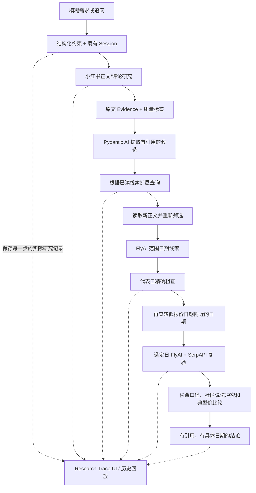

# FareScout P1：系统怎样完成一次研究

更新：2026-10-01。P1 按用户最新授权实现；原始产品需求仍是 `product-requirements.md`，`p1-direction-research.md` 是开发前的调研快照。未迁移 Runtime，未引入 Multi-Agent。

## 从用户提问到研究结论

用户追问时，系统会复用已有原文，重新筛选路线并核对票价；如果没有重新搜索社区，就会如实说明。第一轮最多扩展一次查询。若模型第一次没有提出查询，或提出的词在原文里找不到依据，程序会再让它尝试一次；仍不符合要求，就记录原因并继续处理已有材料。日期安排由程序根据已发现的路线、范围查询结果和已查价格决定，并受调用预算限制，不会让模型任意遍历日历。

## 复用的组件，以及它们怎样参与研究

| 组件 | 继续承担的功能 | 为什么这样选 |
|---|---|---|
| Pydantic AI | 类型化目标补丁、社区查询、候选、原文引用和扩展 | 已运行的 POC 能力，避免迁移运行时；实际请求统计包含 SDK 重试 |
| socai 0.6.1 | 连接用户已登录 Chrome，只读搜索并读正文/评论 | 已有真实验证；不重做浏览器控制或导出 Cookie |
| FlyAI 官方 CLI | 已知路线的日期范围线索和精确航班查询 | 复用既有中国票价适配；范围响应不等于全窗覆盖，税费未知单列 |
| SerpAPI Google Flights | 具体日期含税报价和可选 Price Insights | 与 FlyAI 交叉检查，支持国际路线；不另外增加典型价请求 |
| Session / Evidence | 原文、查询、发布时间、获取时间、追问和历史报价 | 加字段及兼容默认值，保留原 POC 数据，不换数据库 |
| Python stdlib HTTP + SSE / 原生 HTML | 本机界面、逐事件实时更新、历史回放 | 无需新前后端框架及云服务，仍可用 CLI 运行 |

参照依据：[FlyAI 范围参数](https://github.com/alibaba-flyai/flyai-skill)、[Google Flights 查询](https://serpapi.com/google-flights-api)、[Price Insights 字段](https://serpapi.com/google-flights-price-insights)。Google Explore / Deals 在调研中评估过，本轮没有引入或声称已验证其覆盖。

## FareScout 自己补上的部分

- `models.py`：Constraint（约束）记录条件是用户明说、系统推断、默认设置还是沿用前文，并写明实际采用的规则；Event（事件）记录动作 ID、轮次、阶段、数据、耗时和引用的 Evidence（证据）；DateCoverage（日期覆盖）列出范围查询返回的日期、实际精查的日期、失败日期和选定日期。
- `research.py`：中文常见日期与红眼规则、机场和原文校验、证据去重后的轻量候选排序。候选必须来自读过的内容；模型无法创建 Fare。
- `dates.py`：先查日期范围，再抽查代表日期和低价日期附近的日期，最后复验选定日期。先让每条路线都有少量粗查结果，再安排精查；日期探索和最终验价各有调用上限。只在税费口径一致的精确报价中比较价格。
- `engine.py`：每次实际操作都会记下一条事件，并立即完整写入会话文件。程序会检查时间预算，判断本轮已完成、部分完成还是受阻；来源失败和切换过程都会保留记录，也不会用社区晒价填补当前报价。
- `quality.py`：赞助/商业/导流词、图片依赖、过旧或原文明示已过销售期、同文或近似正文关联。不提供伪精确可信分，也不把不同账号自动当独立来源；模型如果声称多个帖子来自彼此独立的来源，系统会将这一点标为待核查；原文引用仍会保留。
- `providers.py`：Google 原始典型区间必须有效且与当前最低报价、单程、人数、舱位等条件一致才参与比较。排除红眼航班后，如果无法确认典型价仍符合相同条件，系统就把比较结果标为未知。
- `web.py` / `ui.html`：界面通过 SSE 显示真实研究事件；回放已完成的 Session 时不会重新调用模型或数据来源。用户修改日期、行程、停留时间或红眼规则后，系统会在同一会话开启新一轮研究，重新探索日期并核对票价；各轮报告分别保存。

旧事件没有 ID 时，程序会按固定规则补上；载入历史数据不会生成新的报价时间。旧日期样本没有记录获取时间时仍标为未知。报告、JSON 和 UI 共用同一份真实研究数据。

## Agent 在研究中会做什么

Agent 会从社区正文中找出路线，并提出下一步调查关键词。每条路线和扩展查询都要附上 Evidence ID（证据编号）及原文摘录，因此它不是从预先写好的日本低价航线清单里挑结果。读到扩展搜索的新帖子后，它还可以调整候选路线。日期调查会参考范围查询和已查票价，在预算内抽查代表日期及低价日期附近的日期。某个来源失败时，系统会接着尝试其他已配置来源；预算用完后，报告保留已有结果并说明没查到的部分。用户追问时只修改相关约束，前文研究仍会继续使用。

这些行为都可以从研究记录中核对。Research Trace（研究轨迹）会显示做了什么、用了哪些输入和证据、得到什么结果、哪里失败以及为什么停止；它不会展示或编造模型的私有思维过程。Agent 也不会不受限制地行动：最多调查五条路线，日期和调用次数都有上限。来源受阻时，系统可能只能给出部分结果。

## FareScout 对用户有什么帮助

FareScout 帮用户发现原本不知道该搜索的路线，再把社区里的线索变成可以核对的具体航班报价。P1 还会回答：“我给出的日期范围里，哪些已查日期更值得关注？”以及“这个结论依据什么？还有哪些日期没查到？”它把中文社区发现、多个来源的当前报价和结果中的不确定之处放在一起说明。一次成功验收只能说明这次研究跑通了，还不能证明系统长期稳定，也没有通过对照实验验证它是否总比用户自己刷半小时社区更快或更好。

## 验证与暂缓

先真实测试核心流程并保存原始 Session（会话）和审计记录，再开启质量与 Deal 判断功能；完整版本更新后另行进行真实测试。具体日期、调用数、失败和逐项 PASS / FAIL 见 [P1 验收](p1-acceptance.md)。

目前暂不做 Runtime 迁移、Multi-Agent、接入更多 OTA、全面接入抖音或公众号、复杂 Deal Score、统一计算交通和行李成本、自建历史价格库，以及预订和交易功能。主要风险是小红书读取耗时或没有正文、FlyAI 体验服务覆盖有限、不同来源税费口径不一致，以及抽查日期较少而漏掉其他机会。
